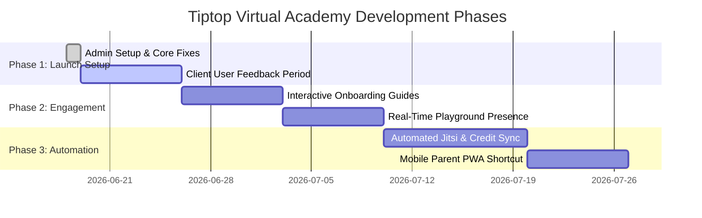

# 🎯 Tiptop Virtual Academy — Strategic Recommendations & Feature Roadmap
### Prepared for: Barbara Olajide, Principal & Administrator
### Prepared by: JBK Technologies (CEO Advisory)

---

## 🌟 Introduction & Value Proposition
Now that your core administrator role is provisioned and the testing guides are in place, the foundation of Tiptop Virtual Academy is set up. 

To help Tiptop Virtual Academy transition from a transactional class platform to a premium, high-retention, virtual school experience, we have outlined strategic recommendations and next-step features. Our main target is to **increase active engagement, reduce parental support requests, and make the virtual school environment feel like a real academy.**

---

## 🚀 Recommended Next Steps & Features

### 1. 🤝 Interactive "First-Day" Student & Parent Onboarding
* **What it is:** A guided, step-by-step interactive popup tutorial when parents or students log in for the very first time.
* **Why it matters:** Barbara's guides are excellent resources, but a step-by-step visual onboarding (e.g., pointing out where to purchase credits, add child details, or check-in to class) will eliminate tech anxiety, decrease setup friction, and build immediate confidence for non-tech-savvy users.

### 2. 🎡 Real-Time Classmate Playground & Lobby Presence
* **What it is:** Enabling real-time status signals (e.g., "5 classmates checked in", "Anna is in the lobby") on the student dashboard before classes start.
* **Why it matters:** This replicates the morning playground arrival of a physical school, creating peer motivation and social excitement. Students are encouraged to arrive early, reducing tardiness and creating an active cohort community.

### 3. 📝 Automated Jitsi Attendance Sync with Credit Ledger
* **What it is:** Automating credit deduction and attendance marking the moment a student successfully connects to the embedded classroom Jitsi video stream.
* **Why it matters:** Reduces manual admin overhead. Parents automatically receive an attendance confirmation receipt, and the credit balance is immediately decremented in the secure database ledger, preventing billing disputes and enhancing operational efficiency.

### 4. 🎨 Age-Customized Classroom Themes (Junior, Senior, Teen)
* **What it is:** Fine-tuning the visual dashboard styles automatically based on the student's age group:
  * **Junior (Ages 3–6):** Playful, larger buttons, gamified badges, and visual icons.
  * **Senior (Ages 7–12):** Interactive challenge listings, XP progress tracker, and community chat.
  * **Teen (Ages 13–16):** Sleek, modern, dashboard-centric interface focusing on certificates and project channels.
* **Why it matters:** A one-size-fits-all dashboard alienates older kids or confuses younger ones. Age-targeted branding increases user retention and creates a more personalized experience.

### 5. 📱 Progressive Web App (PWA) Mobile Portal for Parents
* **What it is:** Optimizing the parent dashboard so they can easily save the application shortcut onto their mobile phone home screen.
* **Why it matters:** Parents want to check on their child's schedules, attendance, and top-up credits quickly while on the go. Providing a mobile-optimized shortcut drives high usage and simplifies their daily oversight.

---

## 📅 Suggested Implementation Timeline

---

*This document is stored as a strategic deliverable inside the [Deliverables](file:///c:/Projects/Tiptop%20Virtual%20Academy/Deliverables/) directory of the codebase.*
