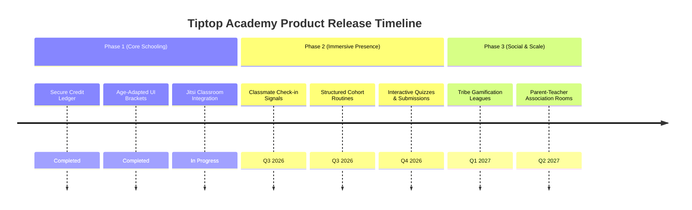

# Strategy: Product Roadmap & User Journeys

**Project:** Tiptop Virtual Academy  
**Category:** Strategy  
**Owner:** Product Engineer  
**Status:** Proposed  
**Created:** 2026-06-14  
**Review Date:** 2026-09-14  
**Related Assets:** [deep-research-director-report.md](file:///c:/Projects/Tiptop%20Virtual%20Academy/Research/deep-research-director-report.md), [cto-architecture-review.md](file:///c:/Projects/Tiptop%20Virtual%20Academy/Decisions/cto-architecture-review.md)

## Executive Summary
This document outlines the product architecture, user journeys, feature prioritization, and multi-phase roadmap for Tiptop Virtual Academy. Our core value proposition is: **Making virtual schooling feel like the real thing.** We transition from a simple video portal to an immersive online school ecosystem featuring structured school days, assemblies, social breaks, and parental governance.

---

## Product Objective
To design and structure a comprehensive online learning platform that replicates the social, instructional, and structural components of a physical academy for students aged 3-16, ensuring high completion rates, active parental involvement, and deep peer-to-peer engagement.

---

## Problem Statement
Most online learning platforms are transactional and isolative (e.g. pre-recorded video feeds or disjointed Zoom links). They lack the structure, peer presence, school spirit, and routines of physical schools. This leads to low student attention spans, lack of accountability, and parental fatigue.

---

## User Analysis
1. **Parent (The School Governor):** Needs simple scheduling control, clear financial billing logs, progress reports, and one-click child supervision dashboards. Pain Point: Lack of time to manage technical setups.
2. **Student (The Learner):** Needs structured school hours, real-time presence of peers, interactive challenges, and age-appropriate dashboards (Junior vs. Senior vs. Teen). Pain Point: Loneliness and video fatigue.
3. **Teacher (The Educator):** Needs availability scheduling, curriculum builder, automated payouts, and classroom management tools. Pain Point: Administrative workload.

---

## Product Definition: "Making Virtual Schooling Real"
To replicate the physical school experience, the product is anchored on four pillars:
1. **The Morning Assembly & Cohort Routines:** Synchronized starts where students see their cohort members before classes begin.
2. **The Classroom Dock:** Embedded secure Jitsi live sessions where children interact without navigating away.
3. **Social Areas & "Tribes":** Supervised text/audio rooms (Forum Channels) for breaks, project collaborations, and clubs.
4. **The Parent Office:** Secure portals for credits, reports, and administrative decisions.

---

## User Journeys

### 1. The Student's Morning Routine (Immersive Start)
- **Step 1:** Student logs in. The system loads the age-adapted theme (Junior, Senior, or Teen).
- **Step 2:** A 10-minute warning block appears before school starts. The student sees status indicators showing classmates who have "checked in."
- **Step 3:** A large, pulsing "Enter Assembly Hall" button appears. Clicking it launches the live meeting.

### 2. The Parent's Weekly Check-In
- **Step 1:** Parent logs in, viewing the unified parent dashboard.
- **Step 2:** Checks active balances, looks at verified attendance records (pulled from Jitsi logs), and reviews progress reports.
- **Step 3:** Purchases additional flexible class credits or adjusts child learning schedules.

---

## MVP Definition ("Virtual School Foundation")
- **Must Have:**
  - Dynamic age switcher rendering Junior (3-6), Senior (7-12), and Teen (13-16) layouts.
  - Credit ledger database architecture auditing transactions.
  - Parent profile control and student onboarding interface.
- **Should Have:**
  - Real-time classmate check-in status (simulating playground arrivals).
  - Embeddable classroom dock with teacher status panels.
- **Could Have:**
  - Gamified tribe competitions (league scoreboards based on cumulative XP).
  - Virtual "Parent-Teacher Association" meeting rooms.

---

## Feature Prioritization

| Feature Name | Target Audience | User Value | Complexity | Priority |
| :--- | :--- | :--- | :--- | :--- |
| **Double-Entry Credit Ledger** | Parents | High (Trust) | Medium | Priority 1 |
| **Age-Adapted UI (Junior/Senior/Teen)** | Students | High (Retention) | Medium | Priority 1 |
| **Cohort Check-in Presence** | Students | Medium (Social) | High | Priority 2 |
| **Virtual Certificates Generator** | Parents/Admin | Medium (Valuation)| Low | Priority 2 |
| **Tribe Gamification Leagues** | Students | High (Engagement) | High | Priority 3 |

---

## Product Roadmap

---

## Risks
- **Student Privacy:** Live check-ins and video feeds must comply with child safety standards.
- **Classroom Latency:** WebRTC connections must remain stable under varying internet connection speeds.

---

## Strategic Recommendations
1. **Focus on Cohorts:** Prioritize fixed-schedule cohort enrollments over flexible class bookings to build student relationships.
2. **Standardize Routines:** Implement a mandatory "Check-in" flow that students complete before starting classes to establish school habits.

---

## Knowledge Handoffs
- **Consumer Skill:** Education Architect
  - **Purpose:** Map curriculum milestones to the new "Immersive Start" routines.
  - **Recommended Action:** Update module plans to include group projects that require tribe interactions.

---

## Candidate Brain Entries
- **Title:** Virtual Presence Product Spec
  - **Category:** Strategy
  - **Project:** Tiptop Virtual Academy
  - **Owner:** Product Engineer
  - **Status:** Proposed
  - **Created:** 2026-06-14
  - **Recommended Storage Path:** Strategy/Virtual-Presence-Product-Spec.md

---

## Product Verdict
**Approved.** Replicating physical school milestones sets Tiptop Virtual Academy apart from generic online tutoring apps.
