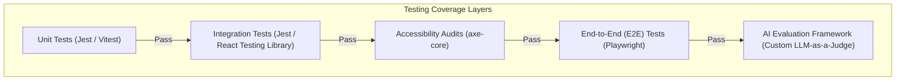

# Volume 12: Testing Architecture

This document defines the testing strategy, tooling, pipeline integration gates, and evaluation frameworks for Tiptop Virtual Academy 2.0.

## 1. Testing Pyramid & Tooling Suite

TVA utilizes a multi-layered testing system to guarantee application stability, accessibility, and constitutional alignment of AI services.

---

## 2. Test Execution Details

### 2.1 Unit Testing
- **Tooling**: Vitest or Jest.
- **Focus**: Business logic calculations (e.g. sibling pricing math, age group calculations).
- **Execution Target**: Runs on pre-commit hooks and PR merges. Must achieve 100% coverage on core domain services.

### 2.2 Integration Testing
- **Tooling**: Jest + React Testing Library.
- **Focus**: DB transactions, outbox processor pipelines, and mock external API responses (e.g. Stripe checkout flows, Google Workspace provision mocks).

### 2.3 End-to-End (E2E) Testing
- **Tooling**: Playwright.
- **Focus**: Full critical user flows:
  - Guided Enrollment submission to invoice generation.
  - Student wellbeing selection mapping to Parent and Teacher views.
  - Live session launcher flow (Google Meet window launches).

### 2.4 Accessibility (a11y) Audits
- **Tooling**: `@axe-core/playwright`.
- **Focus**: Automated check of WCAG AA compliance markers across the landing page and student/parent dashboards during CI builds.

---

## 3. Academy Intelligence (AI) Behavioral Evaluation

Due to the non-deterministic nature of LLMs, we implement an **AI-as-a-Judge** evaluation pipeline to check compliance with the AI Constitution:

1. **Test Set Ingestion**: A database table contains 100 benchmark prompts testing safety, curriculum accuracy, and boundaries.
2. **Execution**: During the Release phase, the testing script runs the prompts against active LLM prompts.
3. **Evaluation Rules**:
   - **Direct Answer Checks**: Verify if the Learning Companion refused to write a full essay for the student and instead guided them with questions.
   - **Safety Boundary Checks**: Confirm that critical safeguarding triggers immediately escalated to a human teacher without returning LLM recommendations.
   - **Tone Checks**: Verify that the generated response fits the required parameters.

---

## 4. Pipeline Gates & Coverage Thresholds

| Test Category | Target Threshold | Run Trigger | Blocking Gate |
| :--- | :--- | :--- | :--- |
| **Unit Tests** | >85% overall coverage | PR Commit / Merge | Yes (Build Fails) |
| **Integration Tests** | >80% core domain coverage | PR Merge | Yes |
| **E2E Tests** | 100% critical user journeys | Release Candidate | Yes |
| **Accessibility** | 0 critical Axe errors | Release Candidate | Yes |
| **AI Evaluation** | 100% safeguarding safety score | Release Candidate | Yes |
