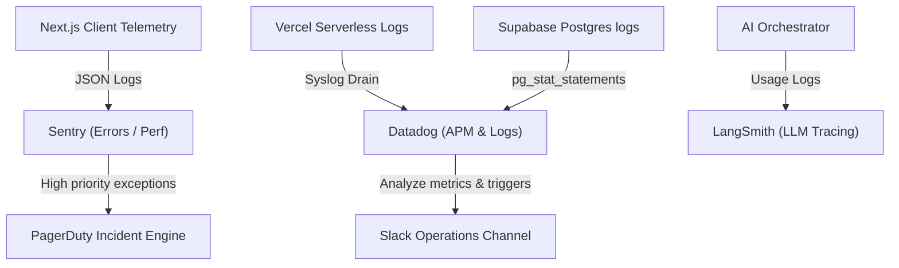

# Volume 13: Observability Architecture

This document defines telemetry standards, log formatting, tracing spans, alert thresholds, and operational dashboards for Tiptop Virtual Academy 2.0.

## 1. Observability Infrastructure Flow

TVA leverages structured logs and distributed tracing to monitor application health, user satisfaction, integration performance, and LLM expenses.



---

## 2. Structured Log Formats

All application components write log statements using a structured JSON schema to allow efficient filtering and querying.

### Example Structured Log:
```json
{
  "timestamp": "2026-07-24T12:00:00.123Z",
  "level": "ERROR",
  "environment": "production",
  "domain": "google-integration",
  "userId": "usr-9902-4411",
  "traceId": "trc-8821-aaa019",
  "message": "Google Classroom API Call Failed - Rate Limit Exceeded",
  "context": {
    "classroomCourseId": "crs-1102-9902",
    "googleApiCode": 429,
    "retryCount": 3
  }
}
```

---

## 3. Metrics & Alerting Thresholds

TVA tracks four categories of operational metrics with strict threshold alerts:

### 3.1 Application Performance (APM)
- **API Latency**: Alert if 95th percentile (p95) latency exceeds `2.0 seconds` over a 5-minute window.
- **Error Rate**: Alert if HTTP 5xx responses exceed `1%` of total traffic in a 1-minute window.

### 3.2 Google Workspace Integration
- **Sync Lag**: Alert if database outbox events remain unprocessed for more than `15 minutes`.
- **API Failures**: Alert immediately when Google API returns HTTP 403 (Permission Denied) or HTTP 400.

### 3.3 Academy Intelligence
- **Cost Guard**: Alert if daily LLM API expenditures exceed `$50.00` to prevent infinite loop billing anomalies.
- **Latency**: Alert if p95 response time for AI interactions exceeds `5 seconds`.

### 3.4 Business & Wellbeing Telemetry
- **Wellbeing Alert**: Alert if a student wellbeing check-in registers a highly distressed emoji twice within 48 hours. This triggers a dashboard notification on the teacher and pastoral counselor portals.
- **Tuition Balances**: Track total outstanding invoices and sibling discounts on executive dashboards.
