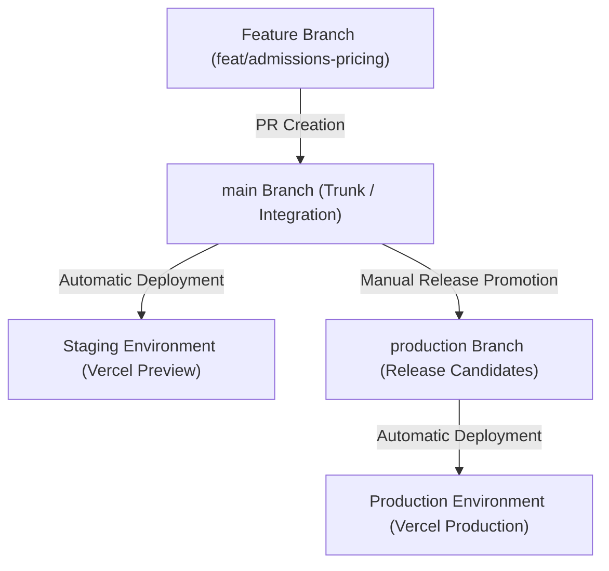

# Volume 14: Delivery Architecture

This document defines the branching strategy, Pull Request guidelines, Continuous Integration/Continuous Deployment (CI/CD) pipelines, and release management rules for Tiptop Virtual Academy 2.0.

## 1. Branching Strategy & Git Flow

TVA utilizes a Git-trunk development model to ensure rapid iteration, with production releases gated by environment branches.

- **Feature Branches**: Named using conventions: `feat/short-description`, `fix/issue-description`, or `chore/task-name`.
- **Merge Restrictions**: Directly pushing code to `main` or `production` branches is blocked at the repository settings level.

---

## 2. Pull Request Review Gates

Before a Pull Request is allowed to merge into the `main` branch, the following automated checks and review gates must pass:

1. **Reviewers**: At least two senior engineers must approve the PR.
2. **Linter Check**: Running `npm run lint` must return zero syntax or style warnings.
3. **TypeScript Build**: Code compilation must pass without errors (`npm run build`).
4. **Unit Tests**: All Vitest/Jest unit tests must run and pass.
5. **Accessibility Check**: Axe Accessibility checks must pass with zero violations on modified pages.

---

## 3. CI/CD Pipeline Steps

TVA uses GitHub Actions to run CI/CD. The pipeline is split into two phases:

### Phase 1: Pull Request Verification (CI)
- Triggered on PR creation or updates to `main`.
- Runs Linter, TypeScript Compiler, Unit Tests, and builds a Vercel Preview deployment link.

### Phase 2: Production Release Deployment (CD)
- Triggered on merges from `main` to `production`.
- Runs integration test suites against staging environment.
- Promotes the Vercel preview deployment to the live URL.
- Automatically applies Supabase database migrations using Supabase release actions.

---

## 4. Release Management & Rollback Procedures

- **Feature Flags**: Heavy feature updates are hidden behind runtime Feature Flags (using PostHog SDK). This allows deploying code to production without exposing unfinished features to users immediately.
- **Rollback SOP**:
  - **Application Code**: If a production deployment causes issues, engineers can trigger a rollback in the Vercel console to immediately repoint traffic to the previous successful build hash within seconds.
  - **Database Migrations**: If a migration causes schema issues, the team rolls back the database state using the Point-in-Time Recovery (PITR) mechanism to a timestamp immediately preceding the deployment, minimizing downtime.
