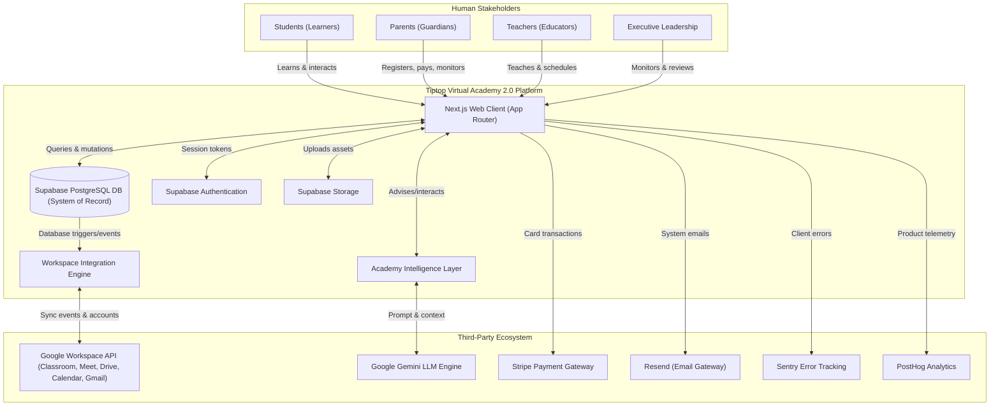

# Volume 1: System Context

This document defines the system boundaries, actors, external integrations, and interactive channels for Tiptop Virtual Academy (TVA) 2.0.

## 1. System Boundary and Context Diagram

The following Mermaid diagram maps the high-level context of TVA, illustrating how human actors and external service platforms interface with the core application.

---

## 2. Interactive Flow Details

### 2.1 Students
- **Interaction Channels**: Dashboard interface, virtual classroom links, wellbeing check-in panel, AI Learning Companion.
- **Data Exchanged**: Academic progress, attendance indicators, wellbeing responses, and assignment submissions (uploaded to Supabase Storage/Google Drive).

### 2.2 Parents
- **Interaction Channels**: Portal dashboard, Guided Enrollment flow, tuition ledger, messages.
- **Data Exchanged**: Enrolled student details, billing transactions (Stripe payment tokens), tuition credits balance, teacher communications, and consent configurations.

### 2.3 Teachers
- **Interaction Channels**: Workspace scheduler, session launcher, lesson planner, messaging modules.
- **Data Exchanged**: Calendar schedules (synchronized to Google Calendar), grading logs, session summaries, class notes, and earnings estimations.

### 2.4 Executive Leadership
- **Interaction Channels**: Executive Dashboard, policy coordinator console, JBK-Core brain management console.
- **Data Exchanged**: Real-time revenue ledgers, enrollment forecasts, teacher assignments, policy settings, and system logs.

---

## 3. External Integrations Specifications

| External System | Integration Channel | Interaction Type | Data Sent | Data Received |
| :--- | :--- | :--- | :--- | :--- |
| **Google Workspace** | REST APIs / SDK | Asynchronous (Event-driven) | User accounts, Classroom syncs, Calendar invites, Meet URLs | Provisioning status, attendee lists, calendar links |
| **Google Gemini** | Secure JSON API | Synchronous | Structured prompt + Context | Generated response, usage metrics |
| **Stripe** | Stripe Elements/SDK | Synchronous | Payment tokens, billing info | Transaction confirmation, webhook receipts |
| **Resend** | HTTPS Mail API | Asynchronous | Transactional mail payloads | Send success validation token |
| **Sentry** | SDK Client agent | Synchronous (Client-side) | Diagnostic stack traces, errors | Log reference ID |
| **PostHog** | Analytics SDK | Asynchronous | Interaction events, page paths | User segment profiling |
