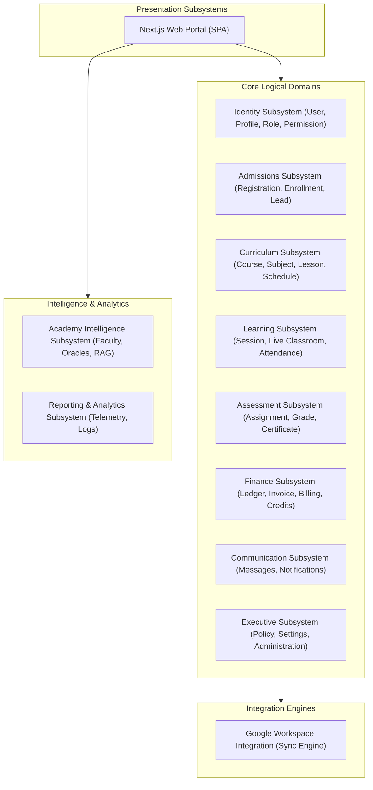

# Volume 2: Logical Architecture

This document defines the logical subsystems and functional boundaries of the Tiptop Virtual Academy 2.0 platform.

## 1. Subsystem Decomposition

The platform is decomposed into cohesive, decoupled subsystems to prevent circular dependencies and isolate business logic boundaries.

---

## 2. Subsystem Definitions & Boundaries

### 2.1 Identity Subsystem
- **Purpose**: Authenticates, authorizes, and handles profile records for all roles.
- **Boundaries**: Owns accounts, authentication states, session management, and profile metadata. Communicates user details to other subsystems via UUID.

### 2.2 Admissions Subsystem
- **Purpose**: Manages new client intake, pricing calculations, program selections, and registration.
- **Boundaries**: Handles application lifecycles from lead status to active student status. Emits `StudentEnrolled` event upon payment verification.

### 2.3 Curriculum Subsystem
- **Purpose**: Defines course offerings, subject syllabus frameworks, and standardized timetables.
- **Boundaries**: System of record for course catalogs, class templates, and schedules. Implements the British curriculum schemas.

### 2.4 Learning Subsystem
- **Purpose**: Manages live learning sessions, Google Meet launcher endpoints, and real-time student attendance.
- **Boundaries**: Coordinates execution of daily calendars. Resolves calendar conflicts.

### 2.5 Assessment Subsystem
- **Purpose**: Evaluates student understanding through assignments, grade records, and graduation certificates.
- **Boundaries**: Owns grade-book entries and learning outcome mappings. Provides read-only data to the parent portal.

### 2.6 Finance Subsystem
- **Purpose**: Manages billing ledgers, tuition accounts, invoice states, sibling discounts, and referral credits.
- **Boundaries**: Handles transaction tracking, Stripe integration callbacks, and financial ledgers.

### 2.7 Communication Subsystem
- **Purpose**: Manages internal communication lines, announcement distribution, and system push notifications.
- **Boundaries**: Handles message state (read/unread), thread isolation, and delivery channels (email/in-app).

### 2.8 Academy Intelligence Subsystem
- **Purpose**: Implements the AI Faculty roles (Learning Companion, Family Advisor, etc.) utilizing context-aware RAG models.
- **Boundaries**: Isolates prompts and LLM adapters. Never bypasses security constraints or modifies data directly.

### 2.9 Executive Subsystem
- **Purpose**: Enforces school settings, policy directives, and administrative dashboard overrides.
- **Boundaries**: System config state, audit registers, and JBK-Core brain management modules.

### 2.10 Google Workspace Integration Subsystem
- **Purpose**: Provisioning utility syncing accounts, Classrooms, Drives, and Calendar items to Google Workspace.
- **Boundaries**: Consumes events emitted by core subsystems and maps them to Google REST APIs asynchronously.

### 2.11 Reporting & Analytics Subsystem
- **Purpose**: Aggregates academic progress, financial records, and engagement statistics.
- **Boundaries**: Non-blocking telemetry processing. Prepares cached data for leadership forecasting dashboards.
