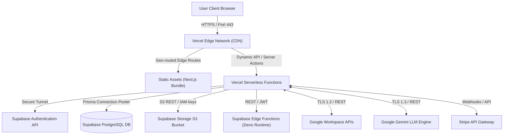

# Volume 3: Physical Architecture

This document defines the production deployment topology, network boundaries, and environment specifications for the Tiptop Virtual Academy 2.0 platform.

## 1. Network & Deployment Topology

The physical architecture separates concerns between static asset delivery, serverless client routing, and the secure, multi-tenant database layer.

---

## 2. Infrastructure Layer Breakdown

### 2.1 Vercel Hosting Platform
- **Service**: Next.js App Router static/dynamic hosting.
- **Regions**: Primary region set to `fra1` (Frankfurt) or closest region matching student concentrations (e.g., West Africa/Europe).
- **CDN Caching**: Edge CDN handles asset caching, static pages, and incremental static regeneration (ISR) page states.

### 2.2 Supabase Platform
- **Authentication**: Managed JWT sign-on with automatic session rotation. Users map to the `auth.users` database table.
- **PostgreSQL Database**: Multi-tenant database cluster with connection pooling via PgBouncer (using transaction mode on port `6543`).
- **Supabase Storage**: S3-compliant object storage partitioned into secure private buckets (e.g., `student-assignments`, `teacher-notes`) with fine-grained RLS access controls.
- **Edge Functions**: Light Deno serverless runtimes used for isolated tasks such as payment verification webhooks and async background tasks.

---

## 3. Secret and Environment Management

Secrets are managed using environment variables injected at build or runtime. They are never committed to git:

- **Vercel Console**: Holds production keys (`DATABASE_URL`, `NEXTAUTH_SECRET`, `STRIPE_SECRET_KEY`, `RESEND_API_KEY`).
- **Supabase Vault**: Encrypts API keys inside the database (e.g., Google Workspace OAuth Client Secrets, Gemini API keys).
- **GitHub Secrets**: Controls keys used in release pipelines (`VERCEL_TOKEN`, `SUPABASE_ACCESS_TOKEN`).

---

## 4. Disaster Recovery & Backup SOP

| Layer | Backup Type | Frequency | Retention Policy | Recovery Strategy |
| :--- | :--- | :--- | :--- | :--- |
| **PostgreSQL Database** | Logical pg_dump & physical WAL archives | Daily logical, Continuous WAL | 30 days history | Rollback using Point-in-Time Recovery (PITR) via Supabase dashboard |
| **Supabase Storage** | Cross-region S3 replication | Continuous | 90 days history | Redirect client access keys to backup region bucket |
| **Application Code** | Git version control | On git push | Indefinite | Deploy last verified Git commit hash via Vercel pipeline |
| **Secrets / Config** | Encrypted config vaults | On manual update | Indefinite | Re-inject secrets manually via infrastructure scripts |
