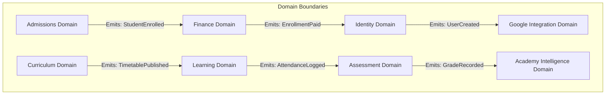

# Volume 4: Domain Architecture

This document defines the business domain models, responsibilities, entities, events, services, repositories, and dependency rules for Tiptop Virtual Academy 2.0.

## 1. Core Domain Dependency Model

To maintain strict modularity, domains communicate only through public events, public service contracts, or asynchronous message exchanges. Cross-domain database joins are strictly prohibited.

---

## 2. Business Domains Specification

### 2.1 Admissions Domain
- **Responsibilities**: Enforces student registration protocols, evaluates age thresholds, calculates pricing options, and models sibling/referral discount rates.
- **Entities**: `Lead`, `EnrollmentRequest`, `StudentProfileCandidate`.
- **Events**: `EnrollmentRequestSubmitted`, `StudentEnrolled`.
- **Services**: `EnrollmentCalculatorService` (computes tuition discounts).
- **Repositories**: `EnrollmentRequestRepository`.
- **Ownership**: admissions team, Admissions Coordinator.
- **Dependencies**: Finance, Identity.

### 2.2 Identity Domain
- **Responsibilities**: Manages profile states, assigns permissions, verifies academic credentials, and guards active user sessions.
- **Entities**: `User`, `StudentProfile`, `TeacherProfile`, `ParentProfile`, `PermissionRole`.
- **Events**: `UserCreated`, `UserRoleUpdated`, `ProfileSuspended`.
- **Services**: `PermissionResolverService`.
- **Repositories**: `UserRepository`, `ProfileRepository`.
- **Ownership**: platform infrastructure team.
- **Dependencies**: Supabase Auth.

### 2.3 Curriculum Domain
- **Responsibilities**: Structures subject templates, controls the course registry, maps British curriculum standards, and logs academic year terms.
- **Entities**: `Course`, `Subject`, `Term`, `LessonTemplate`, `SyllabusMapping`.
- **Events**: `CoursePublished`, `TermCreated`.
- **Services**: `CurriculumMappingService`.
- **Repositories**: `CourseRepository`, `TermRepository`.
- **Ownership**: academic board, Curriculum Directors.
- **Dependencies**: None.

### 2.4 Learning Domain
- **Responsibilities**: Coordinates class cohorts, manages active live class times, launches Google Meet links, and records learner attendance.
- **Entities**: `ClassCohort`, `LearningSession`, `AttendanceRecord`.
- **Events**: `CohortCreated`, `SessionScheduled`, `AttendanceLogged`.
- **Services**: `SessionSchedulerService` (checks calendar conflicts).
- **Repositories**: `SessionRepository`, `CohortRepository`.
- **Ownership**: teaching faculty operations.
- **Dependencies**: Curriculum, Google Integration.

### 2.5 Assessment Domain
- **Responsibilities**: Creates homework templates, coordinates grading rubrics, manages teacher feedback logs, and generates graduation certificates.
- **Entities**: `Assignment`, `Submission`, `GradeEntry`, `Certificate`.
- **Events**: `AssignmentPublished`, `AssignmentSubmitted`, `GradeRecorded`, `CertificateIssued`.
- **Services**: `GradingRubricService`, `CertificateGeneratorService`.
- **Repositories**: `AssignmentRepository`, `SubmissionRepository`.
- **Ownership**: teaching faculty, Academic Director.
- **Dependencies**: Learning.

### 2.6 Finance Domain
- **Responsibilities**: Handles ledger accounts, processes invoices, tracks discount rates, manages payment status, and tracks referral credits.
- **Entities**: `Invoice`, `LedgerAccount`, `CreditTransaction`, `Discounts`.
- **Events**: `InvoiceIssued`, `PaymentReceived`, `CreditApplied`.
- **Services**: `PricingEngineService`, `TuitionLedgerService`.
- **Repositories**: `InvoiceRepository`, `LedgerRepository`.
- **Ownership**: finance department.
- **Dependencies**: Admissions.

### 2.7 Academy Intelligence (AI) Domain
- **Responsibilities**: Coordinates context retrieval pipelines, enforces the AI Constitution, maintains prompt templates, and runs the AI faculty.
- **Entities**: `AIChatSession`, `AIInteractionLog`, `KnowledgeDocument`.
- **Events**: `AIInteractionCompleted`, `AIConstitutionalViolationFlagged`.
- **Services**: `OrchestratorService`, `RAGRetrievalService`, `GeminiAdapter`.
- **Repositories**: `AIChatSessionRepository`, `KnowledgeBaseRepository`.
- **Ownership**: intelligence architecture team.
- **Dependencies**: Identity, Curriculum, Assessment.

### 2.8 Google Integration Domain
- **Responsibilities**: Maps TVA entities to Google Workspace API calls (Classroom, Meet, Drive, Calendar, Gmail).
- **Entities**: `GoogleSyncJob`, `IntegrationMapping`.
- **Events**: `GoogleWorkspaceProvisioned`, `GoogleWorkspaceSyncFailed`.
- **Services**: `GoogleClassroomService`, `GoogleCalendarService`, `GoogleMeetService`.
- **Repositories**: `IntegrationMappingRepository`.
- **Ownership**: integrations engineering team.
- **Dependencies**: Identity, Learning.
