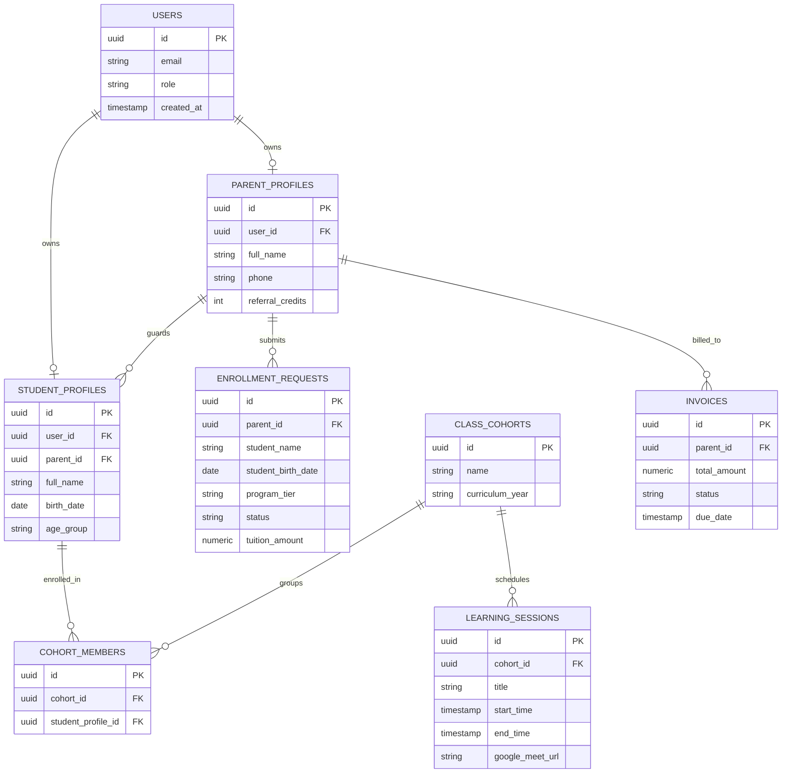

# Volume 5: Database Architecture

This document defines the relational schema, entity relationships, indexing strategies, partitioning rules, Row Level Security (RLS) policies, and database migration guidelines for Tiptop Virtual Academy 2.0.

## 1. Entity-Relationship Diagram (Logical Schema)



---

## 2. Row Level Security (RLS) Policies

Row Level Security is enabled on every database table. Access is gated by the authenticated user's ID (`auth.uid()`) and role retrieved from their JWT claims.

### DDL and RLS Policy Code Examples:

```sql
-- Enable RLS
ALTER TABLE student_profiles ENABLE ROW LEVEL SECURITY;
ALTER TABLE parent_profiles ENABLE ROW LEVEL SECURITY;
ALTER TABLE invoices ENABLE ROW LEVEL SECURITY;

-- Parent Access Policy: Can read/write their own parent profile
CREATE POLICY parent_profile_access ON parent_profiles
    FOR ALL
    USING (user_id = auth.uid())
    WITH CHECK (user_id = auth.uid());

-- Parent Access Policy: Can read their children's student profiles
CREATE POLICY parent_child_access ON student_profiles
    FOR SELECT
    USING (
        parent_id IN (
            SELECT id FROM parent_profiles WHERE user_id = auth.uid()
        )
    );

-- Student Access Policy: Can read their own student profile
CREATE POLICY student_self_access ON student_profiles
    FOR SELECT
    USING (user_id = auth.uid());

-- Invoice Access Policy: Parents can read their own invoices
CREATE POLICY parent_invoice_access ON invoices
    FOR SELECT
    USING (
        parent_id IN (
            SELECT id FROM parent_profiles WHERE user_id = auth.uid()
        )
    );
```

---

## 3. Database Partitioning & Indexing Strategy

### 3.1 Indexing Model
- **Primary Keys**: Always defined as `uuid` and automatically indexed.
- **Foreign Keys**: Indexes are explicitly declared on all foreign keys to prevent sequential scans during join queries.
  - `CREATE INDEX idx_student_profiles_parent ON student_profiles(parent_id);`
  - `CREATE INDEX idx_cohort_members_student ON cohort_members(student_profile_id);`
  - `CREATE INDEX idx_learning_sessions_cohort ON learning_sessions(cohort_id);`
- **Search Optimization**: B-Tree indexes on query bounds:
  - `CREATE INDEX idx_sessions_time ON learning_sessions(start_time, end_time);`

### 3.2 Partitioning Rules
- **High-Volume Tables**: Tables containing large volumes of logs or telemetry (e.g., `ai_interaction_logs`, `audit_logs`) are partitioned by date.
- **Partitioning Method**: Range partitioning by month.
  - `CREATE TABLE ai_interaction_logs (id uuid, interaction_time timestamp, ...) PARTITION BY RANGE (interaction_time);`

---

## 4. Database Migration & Deployment Pipeline

1. **Migration Files**: Schema changes are written as incremental SQL files managed inside the `supabase/migrations/` directory.
2. **Version Control**: Every migration file must follow the naming standard: `<timestamp>_name_of_migration.sql`.
3. **Local Testing**: Migrations are tested locally using the Supabase CLI (`supabase migration up`) prior to deployment.
4. **CI/CD Deployment**: GitHub Actions runs production database schema migrations using CLI tools in a dry-run state to check for schema locks before running migrations.
5. **No Destructive Schema Modifications**: Deleting columns or modifying data types in production requires a multi-phase deploy strategy:
   - Phase A: Add new nullable column.
   - Phase B: Dual-write data to both columns in the application code.
   - Phase C: Migrate existing data asynchronously.
   - Phase D: Deprecate and drop the old column.
