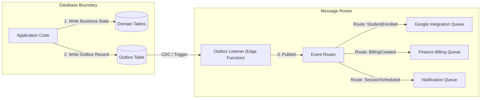

# Volume 6: Event Architecture

This document defines the event-driven patterns, schema contracts, event routing, retry mechanisms, and Dead Letter Queue (DLQ) designs for Tiptop Virtual Academy 2.0.

## 1. Event Broker & Dispatch Topology

To ensure transactional safety, TVA uses the **Transactional Outbox Pattern**. Events are written to an `outbox` table in the database within the same local transaction as the main database state changes. An asynchronous process monitors the outbox and publishes the messages.



---

## 2. Event Catalog Specification

### 2.1 Event: `student.enrolled`
- **Publisher**: `Admissions Domain`
- **Subscribers**: `Identity Domain`, `Finance Domain`, `Google Workspace Integration Domain`
- **Payload Schema**:
```json
{
  "eventId": "evt-77e8-4221-a489",
  "eventType": "student.enrolled",
  "timestamp": "2026-07-24T12:00:00Z",
  "data": {
    "studentId": "std-8821-2290",
    "parentId": "prt-3120-4491",
    "fullName": "Alice Smith",
    "birthDate": "2018-05-12",
    "academicYear": "Primary Year 3",
    "baseTuition": 750000.00,
    "discountPercentage": 10.00,
    "finalTuition": 675000.00
  }
}
```

### 2.2 Event: `session.scheduled`
- **Publisher**: `Learning Domain`
- **Subscribers**: `Google Workspace Integration Domain`, `Communication Domain`
- **Payload Schema**:
```json
{
  "eventId": "evt-1290-4bf2-9844",
  "eventType": "session.scheduled",
  "timestamp": "2026-07-24T12:05:00Z",
  "data": {
    "sessionId": "ses-9921-1200",
    "cohortId": "coh-3392-4410",
    "teacherId": "tch-4490-1209",
    "subjectName": "Mathematics",
    "startTime": "2026-07-27T09:00:00Z",
    "endTime": "2026-07-27T10:00:00Z"
  }
}
```

### 2.3 Event: `grade.recorded`
- **Publisher**: `Assessment Domain`
- **Subscribers**: `Identity Domain`, `Academy Intelligence Domain`
- **Payload Schema**:
```json
{
  "eventId": "evt-5521-432a-77d0",
  "eventType": "grade.recorded",
  "timestamp": "2026-07-24T12:10:00Z",
  "data": {
    "studentId": "std-8821-2290",
    "assignmentId": "asg-2210-9092",
    "gradeValue": "A",
    "maxGrade": "A",
    "feedbackText": "Excellent understanding of fractions.",
    "evaluatorId": "tch-4490-1209"
  }
}
```

---

## 3. Reliability & Error Recovery Policies

### 3.1 Retry Strategy
- **Interval**: Exponential backoff with jitter.
  - Base delay: `2 seconds`.
  - Max delay: `15 minutes`.
  - Retries cap: `5 attempts`.

### 3.2 Dead Letter Queue (DLQ)
- **DLQ Trigger**: If an event execution fails 5 times, it is marked as `FAILED` inside the database, and its payload is moved to a dead-letter register table (`dead_letter_events`) containing:
  - Original event payload.
  - Target subscriber route.
  - Last error message.
  - Execution stack trace.
- **Alerting**: A Critical Alert is emitted to Sentry/Slack when a new item lands in the DLQ.

### 3.3 Idempotency Guarantees
- **Message Keys**: Every event must include a unique `eventId` UUID.
- **Subscriber Verification**: Target handler databases maintain a processed-event table (`processed_events`) where they record the `eventId` upon successful execution. Before executing any handler transaction, the subscriber must check if the `eventId` already exists. If yes, the message is ignored.
