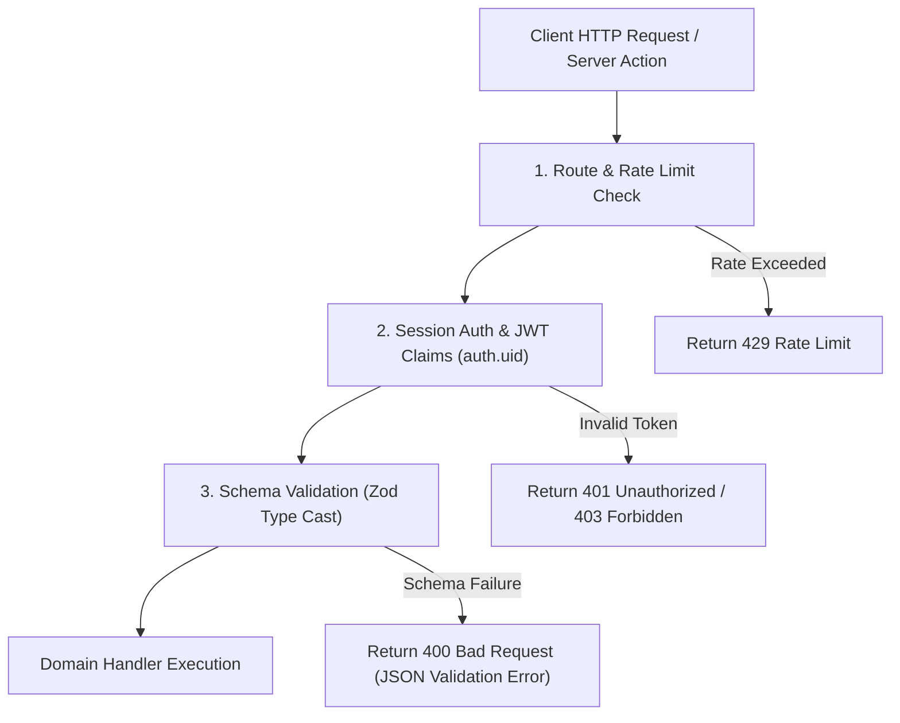

# Volume 7: API Architecture

This document defines the REST API routes, Next.js Server Actions, data validation schemas, authentication middleware gates, and rate limiting thresholds for Tiptop Virtual Academy 2.0.

## 1. Gateway & Middleware Pipeline

All client requests (HTTP REST or Next.js Server Actions) undergo a three-layer gateway validation process before executing domain logic.



---

## 2. API Specifications (REST endpoints & Server Actions)

### 2.1 Admissions API

#### `POST /api/admissions/enroll`
- **Description**: Submits a new guided enrollment request.
- **Access Control**: Public (Rate-limited to 5 requests/minute per IP).
- **Zod Request Schema**:
```typescript
import { z } from 'zod';

export const EnrollmentRequestSchema = z.object({
  parentFullName: z.string().min(2).max(100),
  parentEmail: z.string().email(),
  studentName: z.string().min(2).max(100),
  studentBirthDate: z.string().refine((val) => !isNaN(Date.parse(val)), {
    message: "Invalid date format",
  }),
  programTier: z.enum(['early-years', 'primary', 'secondary']),
  referralCode: z.string().optional(),
});
```

---

### 2.2 Learning API

#### `GET /api/learning/schedule`
- **Description**: Returns all scheduled classes for a student profile.
- **Access Control**: Authenticated (Requires role: `STUDENT` or `PARENT`).
- **Authorization Rule**: Parent can only access schedule details if their child is attached to their profile record in the database.

---

### 2.3 Finance API (Server Actions)

#### `submitPaymentAction(invoiceId: string, stripeToken: string)`
- **Description**: Submits invoice balance payment processing to Stripe.
- **Access Control**: Authenticated (Requires role: `PARENT`).
- **Error Handling**: Captures decline codes from Stripe and returns descriptive, localized errors instead of raw exceptions.

---

## 3. Rate Limiting and Traffic Management

TVA enforces rate limiting at the Edge routing layer using Vercel Middlewares:

- **Public Endpoint Limitation**: `POST /api/admissions/enroll` is limited to 5 submissions per minute per IP using a token bucket algorithm.
- **General Authenticated Endpoints**: Gated to 60 requests per minute per authenticated user session.
- **AI Chat Endpoint**: Gated to 15 interaction calls per minute per user to manage LLM API costs.

---

## 4. Standard Response Format

To ensure API consistency, all REST responses match the following JSON structures:

### Successful Execution:
```json
{
  "success": true,
  "data": {
    "requestId": "req-9902-12aa",
    "status": "pending_payment"
  }
}
```

### Validation or Execution Error:
```json
{
  "success": false,
  "error": {
    "code": "VALIDATION_FAILED",
    "message": "The request payload contains invalid values.",
    "details": [
      {
        "field": "studentBirthDate",
        "issue": "Student must be at least 3 years old."
      }
    ]
  }
}
```
