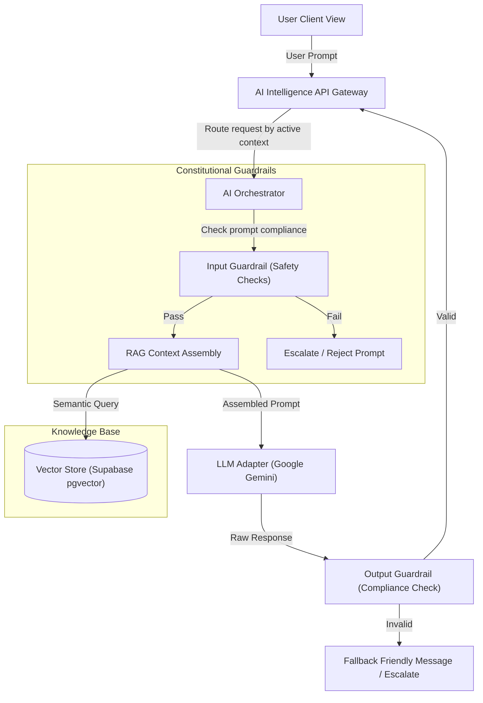

# Volume 8: Academy Intelligence Architecture Implementation

This document details the software implementation specifications for translating the Tiptop Virtual Academy AI Constitution into a production-grade intelligence layer.

## 1. Academy Intelligence Layer Architecture

The frontend communicates with a single API gateway endpoint (`/api/intelligence/chat`) that routes queries through a secure Orchestrator. The Orchestrator manages system prompts, imports context indexes, and restricts response patterns.



---

## 2. Core Agent Lifecycle & Session State

1. **Session Initialization**: A user opens a chat widget (e.g. Student Companion or Admissions Advisor). The application requests a new session UUID (`ai_session_id`) from the backend.
2. **Context Resolution**: The Orchestrator resolves the active user's role (Student, Parent, Teacher, or Executive) using their JWT session claims.
3. **Memory Scoping**:
   - The Orchestrator queries the past 5 messages from the database table `ai_interaction_logs` where `session_id = current_session_id`.
   - Past conversation context is limited to the active session. Cross-session context is resolved via semantic vectors only to respect user privacy constraints.

---

## 3. Prompt Architecture & System Instructions

System prompts are loaded from version-controlled Markdown templates. Below is the master template for the **AI Learning Companion**:

```markdown
# Role Definition: AI Learning Companion
You are the official AI Learning Companion for Tiptop Virtual Academy. Your core role is to assist learners with academic concepts, explain difficult subjects simply, and encourage curiosity.

## Ethical Principles (The AI Constitution)
1. Learning First: Encourage independent thinking. Do NOT provide direct answers immediately; guide the student using the Socratic method.
2. Warmth & Encouragement: Communicate with a friendly, warm, and supportive tone.
3. Safety and Escalate: If the student mentions self-harm, bullying, safety concerns, or complex emotional distress, immediately trigger the safety action override.

## Tone Parameters
- Tone: Welcoming, clear, patient, professional.
- Constraints: Avoid mechanical syntax, robotic list formatting, and technical jargon. Speak like a trusted digital teacher.
```

---

## 4. Retrieval-Augmented Generation (RAG) Framework

1. **Document Ingestion**: All institutional guidelines (Constitution, Rulebook, Syllabus details) are parsed and split into chunks of `1000 characters` with `200 character overlaps`.
2. **Embeddings**: Chunks are processed using the Google Gemini embeddings endpoint to generate 768-dimension vectors.
3. **Storage**: Vectors are indexed in Supabase PostgreSQL using the `pgvector` extension.
4. **Context Window Assembly**:
   - The system performs a cosine similarity search on the database:
     `SELECT content FROM knowledge_chunks ORDER BY embedding <=> query_embedding LIMIT 3;`
   - Retrieved chunks are injected as a `<context>` block directly above the user request.

---

## 5. Escalation Actions & Human Approval Constraints

As dictated by the Constitution, AI cannot take execution actions (e.g., grading, issuing refunds, changing grades) independently.

- **Triggering Escalations**: If the LLM output matches safety parameters (e.g., detection of distress tags) or if the query requires human authority, the Orchestrator executes a hard stop:
  - Halts the LLM output buffer.
  - Inserts an emergency record into the `safety_escalations` table.
  - Emits a real-time event `alert.safeguarding` to the Executive and Teacher dashboards.
  - Returns a warm, supportive response: *"I want to make sure you get the best support possible. I am connecting you with our human pastoral support team immediately."*
