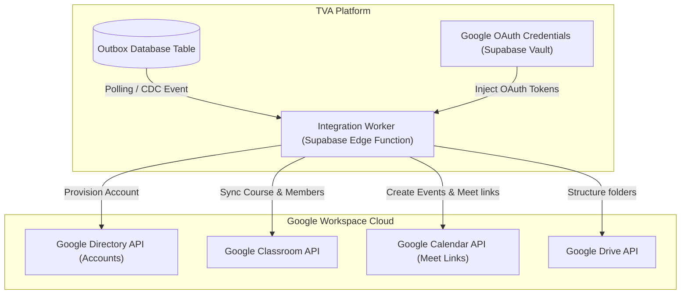

# Volume 9: Google Workspace Integration

This document defines the technical integration specification, account sync logic, and failure handling pipelines connecting Tiptop Virtual Academy 2.0 with Google Workspace APIs.

## 1. Integration Engine Architecture

TVA serves as the single system of record. Changes to enrollment states or schedules write events to the TVA Outbox. The Integration Engine reads these events asynchronously, authenticates using Google Service Account credentials, and calls the Google APIs.

---

## 2. API Scope & Provisioning Guidelines

### 2.1 Google Directory API (Provisioning Accounts)
- **Scope**: `https://www.googleapis.com/auth/admin.directory.user`
- **Logic**: When a student or teacher profile is activated, the Integration Engine creates a Google Workspace identity (e.g. `student.name@tiptopacademy.co.uk`) with generated temporary passwords, dispatched to the parent's primary email.

### 2.2 Google Classroom API
- **Scope**: `https://www.googleapis.com/auth/classroom.courses`
- **Logic**: When a class cohort is finalized, a Google Classroom Course is provisioned. Students are enrolled as members; teachers are registered as course owners.

### 2.3 Google Calendar & Meet
- **Scope**: `https://www.googleapis.com/auth/calendar`
- **Logic**: For every scheduled learning session, a Google Calendar event is created with the parameter `"conferenceDataVersion": 1` to generate a unique Google Meet link. The generated link is returned and stored in the TVA database `learning_sessions` table.

### 2.4 Google Drive
- **Scope**: `https://www.googleapis.com/auth/drive`
- **Logic**: Creates shared class folders containing read-only curriculum documents and individual student dropboxes for assignments.

---

## 3. Transaction Safety & Conflict Resolution

- **Idempotent Sync Tokens**: Every API execution logs the payload request hash inside the integration database mapping table `integration_mappings`. If the integration worker encounters a conflict error (e.g., HTTP 409: *"User already exists"*), it queries Directory API to verify if the account is already active, updates the status to `ACTIVE`, and maps the mapping reference.
- **Out of Sync Recovery Protocol**: A daily automated comparison script runs at 02:00 UTC, matching the active student rosters in the TVA database against Google Classroom membership groups. Any discrepancies are queued for repair.
- **Failures and Circuit Breakers**:
  - If a call to Google APIs fails (e.g., rate limits), the integration worker backs off exponentially.
  - If failures exceed 10 consecutive API errors, the Integration Engine halts integration queues, alerts system engineers, and triggers a fallback mode where local mock links are displayed so live learning is not interrupted.
