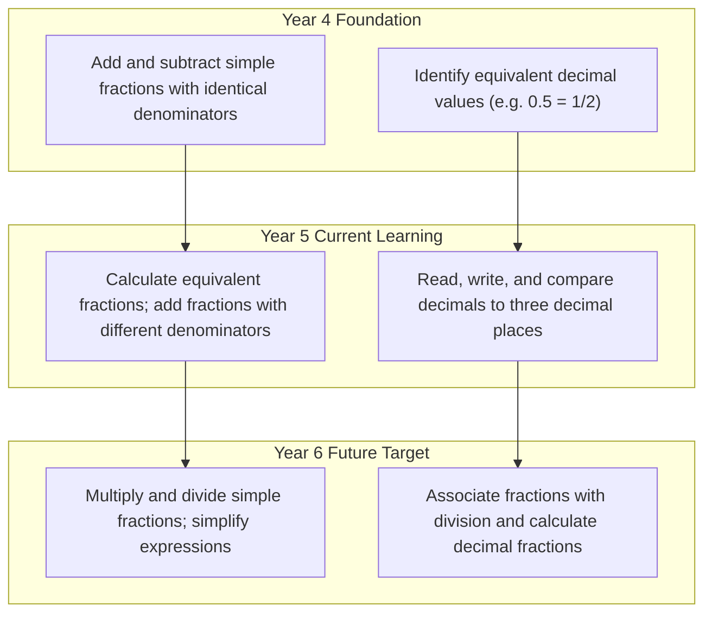

# Volume 5: Learning Progression

This document defines the academic progression maps for Tiptop Virtual Academy. These maps serve as the single source of truth for the AI Learning Companion when evaluating student progress and recommending learning path adjustments.

## 1. Mathematics Progression Map

---

## 2. English Progression Map

### 2.1 Primary Year 4 (Previous Knowledge)
- **Reading**: Identify main ideas in paragraphs; decode unfamiliar words using phonics.
- **Writing**: Use basic punctuation (commas, apostrophes); write short, chronological narratives.

### 2.2 Primary Year 5 (Current Learning)
- **Reading**: Compare themes across texts; identify figurative language (metaphor, simile).
- **Writing**: Structure writing into paragraphs; use parenthetical brackets; write persuasive essays.

### 2.3 Primary Year 6 (Future Learning)
- **Reading**: Evaluate how authors create mood; analyze complex text structures.
- **Writing**: Use active/passive voice; write detailed analytical essays; employ colon and semicolon separators.

---

## 3. Science Progression Map

### 3.1 Primary Year 4 (Previous Knowledge)
- **Living Things**: Classify animals using keys; identify simple food chains.
- **Physics**: Understand gravity and magnet forces.

### 3.2 Primary Year 5 (Current Learning)
- **Living Things**: Map life cycles of mammals, amphibians, insects, and birds.
- **Physics**: Understand friction, air resistance, and simple gears/pulleys.

### 3.3 Primary Year 6 (Future Learning)
- **Living Things**: Map human circulatory systems; understand inheritance and evolution.
- **Physics**: Map light travel pathways; calculate simple electrical circuits.
