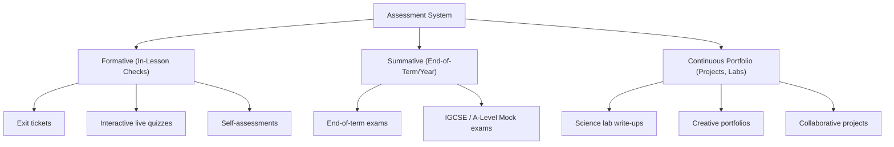

# Volume 6: Assessment Framework

This document defines the evaluation types, grading rubrics, continuous progress monitoring rules, and promotion criteria for the British Curriculum Package at Tiptop Virtual Academy.

## 1. Assessment Categories

---

## 2. Evaluation Methods

### 2.1 Formative Assessment
- **Role**: Diagnostic check-ins to evaluate understanding during lessons.
- **Frequency**: Every live session includes a 5-minute exit ticket or interactive quiz.

### 2.2 Summative Assessment
- **Role**: Evaluates cumulative mastery at the end of key learning stages.
- **Frequency**: End-of-term examinations and mock papers for exam groups (Year 6, IGCSE, and A-Levels).

### 2.3 Continuous Portfolio Assessment
- **Role**: Practical evaluation of real-world skills.
- **Frequency**: Termly projects (e.g. geometric designs, creative writing portfolios, lab write-ups).

---

## 3. Grading Systems & Calculations

TVA employs a percentage-based grading system mapped to letter grades:

| Percentage Range | Letter Grade | Academic Standing |
| :--- | :--- | :--- |
| **90% - 100%** | A* / A | Working at Greater Depth (WGD) |
| **70% - 89%** | B / C | Working at Expected Standard (WES) |
| **50% - 69%** | D / E | Working Towards Expected Standard (WTES) |
| **Below 50%** | U | Unsatisfactory (Requires Intervention) |

### Grade Weighting Model:
- **Summative Assessments**: 40% of final grade.
- **Continuous Portfolio**: 40% of final grade.
- **Homework & Formative Tasks**: 20% of final grade.

---

## 4. Promotion and Graduation Criteria

- **Academic Promotion**: Moving to the next Year level requires a final grade of **C (70%)** or higher in core subjects (English and Mathematics).
- **Academic Intervention Trigger**: Any student averaging below **50%** in core subjects over a 4-week period is automatically enrolled in 1-to-1 booster sessions.
- **Graduation Requirements**: Secondary school graduation is awarded upon passing mock examinations or achieving five passing grades (grades 4-9) on Cambridge IGCSE examinations.
