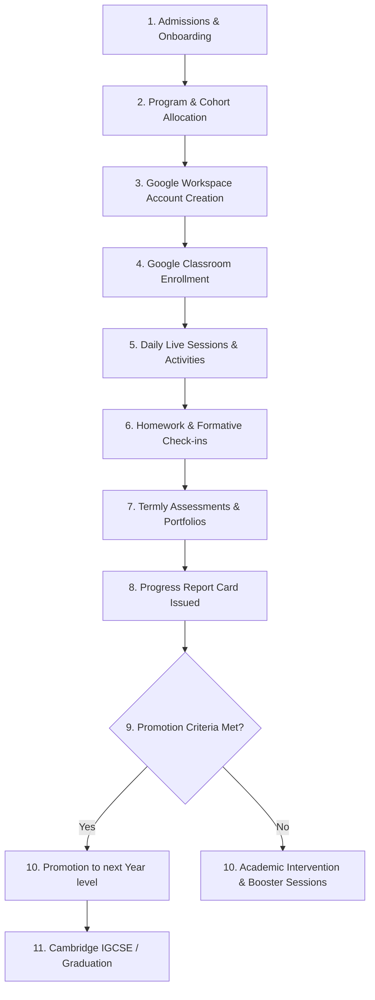

# Volume 8: Student Learning Journey

This document defines the complete learner experience path within Tiptop Virtual Academy, tracking the student journey from onboarding to graduation.

## 1. Student Journey Path

---

## 2. Experience Stage Specifications

### 2.1 Admissions & Onboarding
- **Parent Actions**: Submits registration form, completes payment, and receives the welcome email.
- **System Actions**: Generates user accounts in Supabase and maps parent and student profiles.

### 2.2 Program & Cohort Allocation
- **System Actions**: Places the student in a cohort based on age and placement evaluation results.
- **Data Trigger**: Emits `cohort.assigned` event.

### 2.3 Account Provisioning & Google Integration
- **System Actions**: Google Sync worker provisions the student's email account (`@tiptopacademy.co.uk`) and syncs them to their respective Google Classrooms.

### 2.4 Daily Learning Execution
- **Student Actions**: Navigates their Student Dashboard, logs their daily wellbeing check-in, launches live lessons (Google Meet), and views upcoming tasks.

### 2.5 Evaluation & Progression
- **Student Actions**: Submits assignments via Google Classroom and completes exit tickets.
- **Teacher Actions**: Records grades and feedback on report cards.
- **System Actions**: Evaluates termly performance to determine promotion status.
