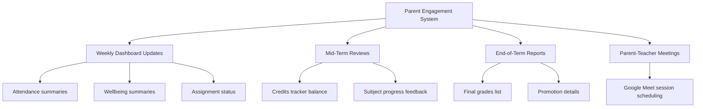

# Volume 9: Parent Learning Journey

This document defines the communication schedule, progress reporting frequency, credit tracking parameters, and teacher interaction guidelines for parents and guardians.

## 1. Parent Touchpoints

---

## 2. Parent Journey Touchpoint Detail

### 2.1 Weekly Dashboard Updates
- **Frequency**: Every Friday at 16:00 UTC.
- **Delivery**: Parent Portal Dashboard + email summary.
- **Content**: Weekly attendance rates, completed assignments count, and a summary of child wellbeing check-in records.

### 2.2 Mid-Term Reviews
- **Frequency**: Week 6 of each Term.
- **Delivery**: In-portal progress report.
- **Content**: Core subject progress feedback and credit balance status.

### 2.3 End-of-Term Reports
- **Frequency**: Week 12 of each Term.
- **Delivery**: PDF report card generated via portal.
- **Content**: Detailed subject mastery percentages, teacher comments, and promotion recommendations.

### 2.4 Parent-Teacher Consultations
- **Frequency**: Termly.
- **Delivery**: 15-minute live consultations scheduled via the Parent Portal and hosted on Google Meet.
- **Goal**: Discuss learning goals and review academic progress.

---

## 3. Communication Expectations

- **Response Time Guarantee**: Parents can send direct messages to teachers via the portal. Teachers are expected to reply within 24 business hours.
- **AI Family Advisor**: Parents can consult the AI Family Advisor at any time to receive context-aware explanations of report card details, helping them understand how to support learning at home.
- **Escalation Rules**: If a parent raises concerns regarding grading disputes, medical issues, or policy changes, the AI Family Advisor immediately routes the query to a human coordinator.
